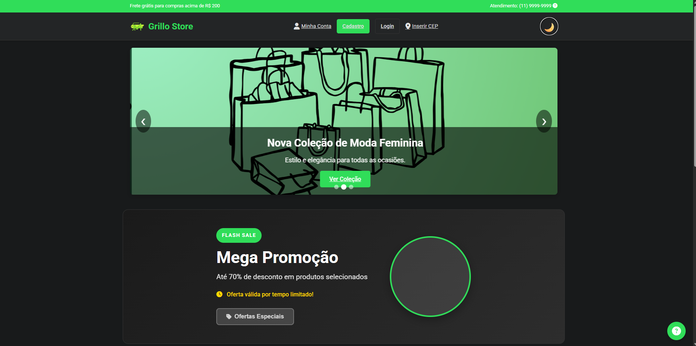
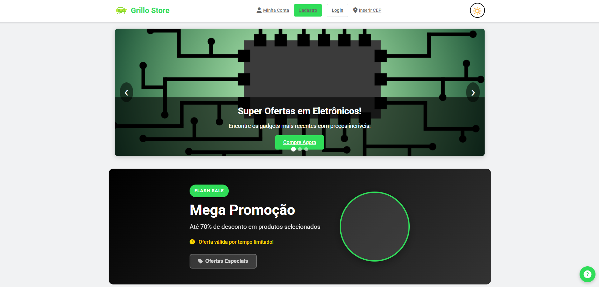
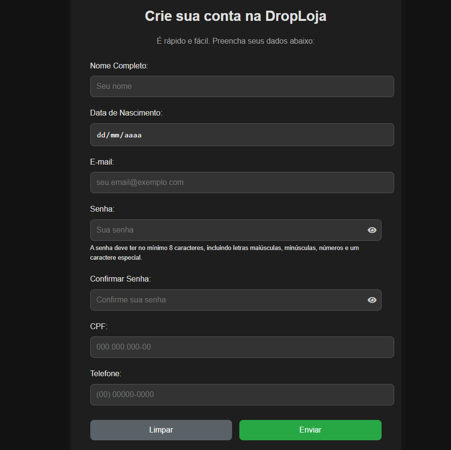
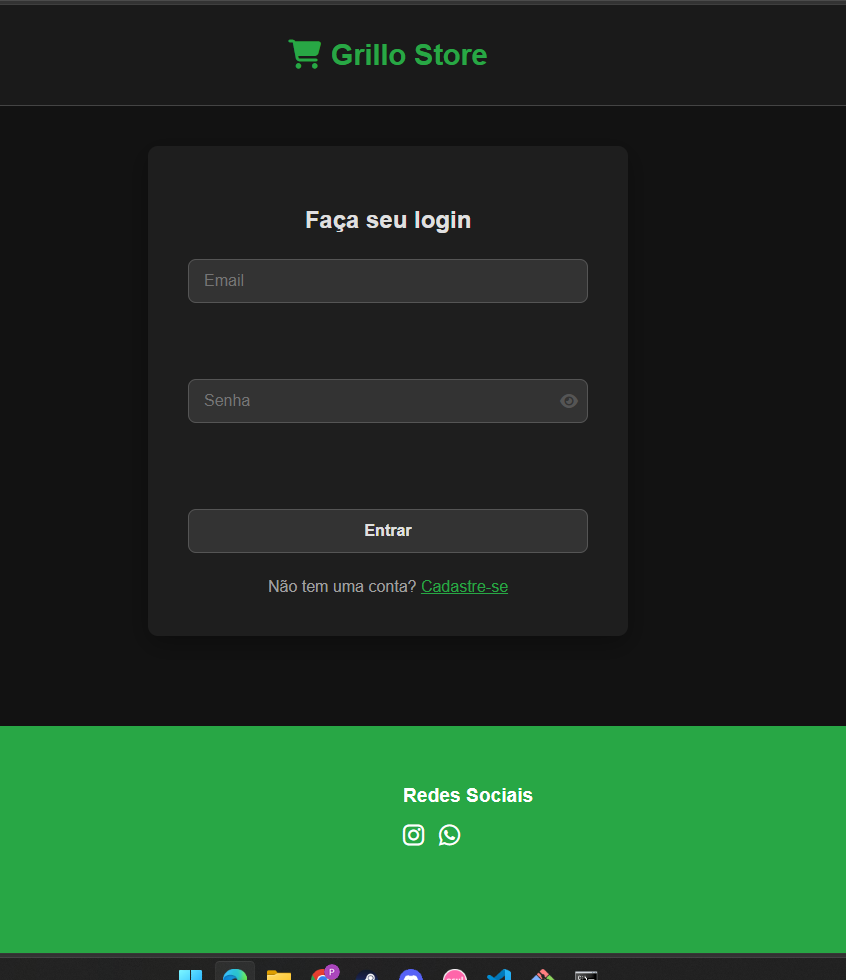
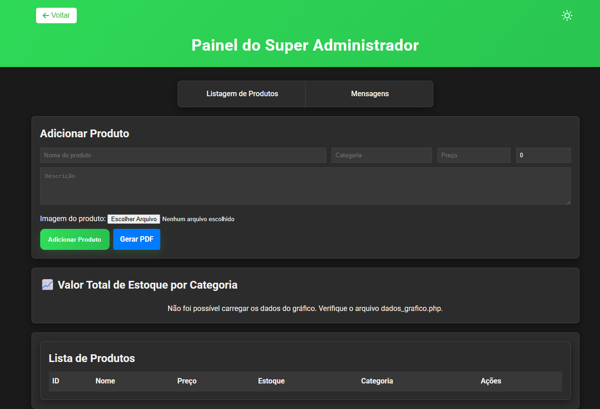
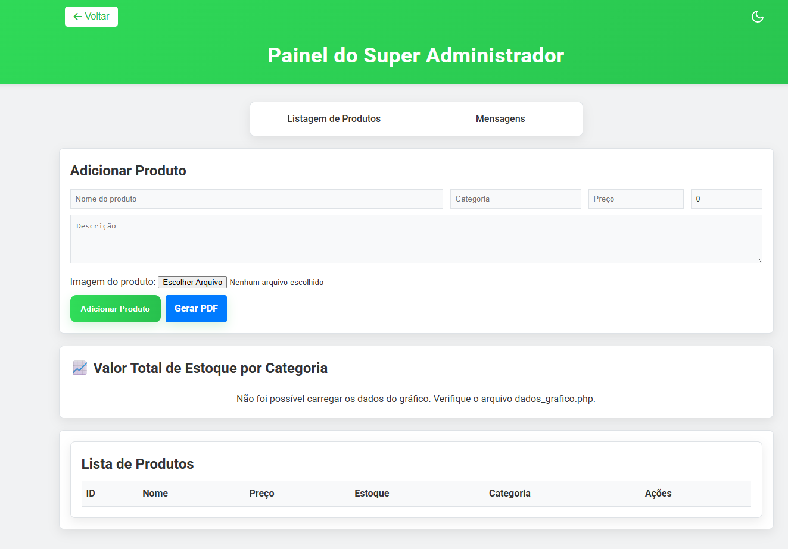
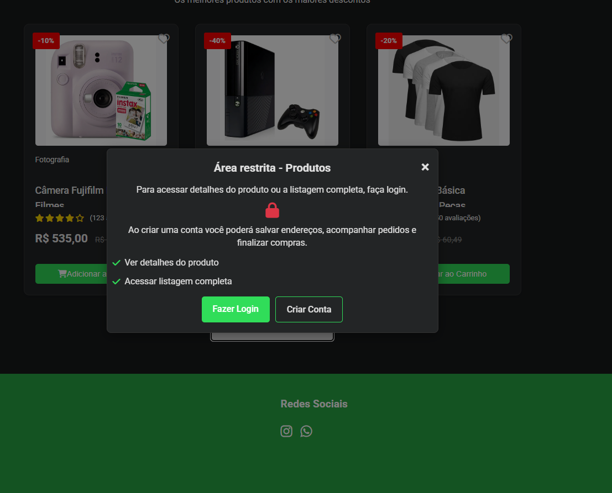
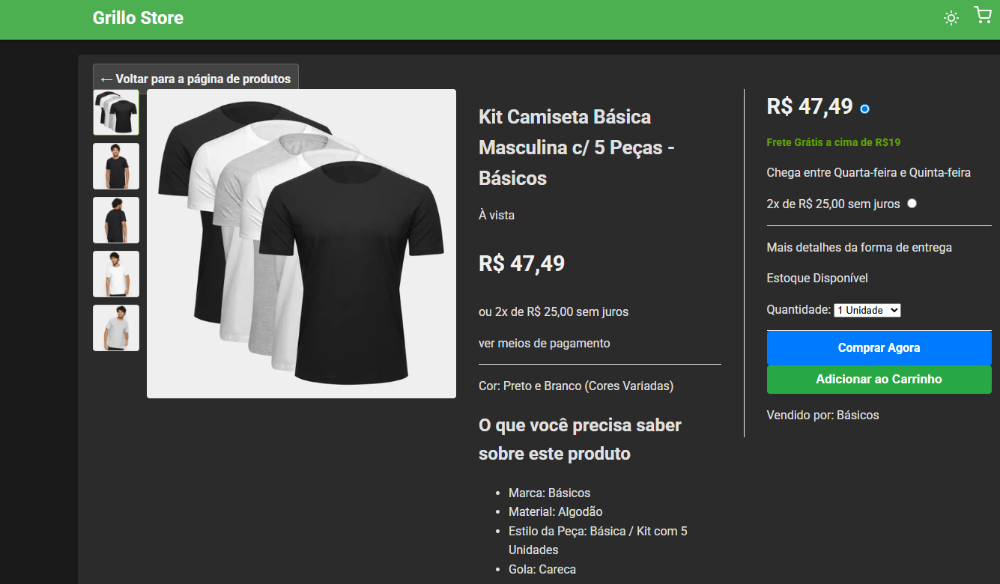

# 🛒 Grillo Store - E-commerce

  <a href="#-português">Português</a> • 
  <a href="#-english">English</a>

---

## 🇧🇷 Português

Este é um projeto de sistema de vendas online desenvolvido como parte da graduação em **Análise e Desenvolvimento de Sistemas**. A plataforma simula uma loja real com foco em hardware, eletrônicos e moda, incluindo um painel administrativo para gestão de estoque e usuários.

## 🚀 Funcionalidades
* **Sistema de Login e Cadastro**: Validação de usuários e níveis de acesso.
* **Painel Administrativo (CMS)**: Área restrita para super administradores gerenciarem o site.
* **Modo Escuro (Dark Mode)**: Interface adaptável para melhor experiência do usuário.
* **Cálculo de Frete**: Integração para inserção de CEP e validação de endereço.
* **Carrinho de Compras**: Gerenciamento de itens em tempo real via Sessão PHP.

## 📸 Demonstração

### Home Page (Modo Escuro / Claro)

### Cadastro e Login

### Painel do Administrador (Modo Escuro / Claro)

### Outras Telas
* **Acesso Restrito:** 
* **Visualização de Produto:** 

## 🛠️ Tecnologias
* **Backend**: PHP 8.x
* **Banco de Dados**: MySQL
* **Frontend**: HTML5, CSS3 e JavaScript
* **Segurança**: Middlewares de validação de sessão

> [!IMPORTANT]
> **Nota sobre os prints:** O projeto requer o XAMPP ou serviço similar para rodar com todos os dados dinâmicos. Como estou sem o ambiente configurado no momento, os prints mostram a estrutura principal do sistema.

## 🔧 Como Rodar o Projeto 
1. Clone este repositório.
2. Certifique-se de ter o **XAMPP** ou servidor similar instalado.
3. Importe o arquivo `grillo_store_db.sql` (na pasta `/sql`) para o seu PHPMyAdmin.
4. Configure as credenciais no arquivo `conexao.php`.
5. Acesse `http://localhost/seu-projeto/paginas/Principal.php`.

## 👤 Desenvolvedores
* **Pablo Vinícius de Oliveira Gomes**
* **Samuel**
* **Gabriel Suliano**
* **Anna Beatriz Freitas**

---

## 🇺🇸 English

This is an online sales system project developed as part of the **Systems Analysis and Development** undergraduate program. The platform simulates a real-world store focusing on hardware, electronics, and fashion, including a full administrative dashboard for inventory and user management.

## 🚀 Features
* **Authentication System**: User login and registration with access level validation.
* **Admin Dashboard (CMS)**: A restricted area for super-admins to manage website content.
* **Dark Mode**: A responsive interface that adapts to user preference.
* **Shipping Calculation**: Integration for ZIP code (CEP) input and address validation.
* **Shopping Cart**: Real-time item management powered by PHP Sessions.

## 📸 Screenshots

### Home Page (Dark / Light Mode)

### Admin Panel (Dark / Light Mode)

### Sign up/ log in

### Administrator Panel (Dark/Light Mode)

### Other Screens
* **ARestricted access:** 
* **Product Preview:** 

## 🛠️ Tech Stack
* **Backend**: PHP 8.x
* **Database**: MySQL
* **Frontend**: HTML5, CSS3, and JavaScript
* **Security**: Session validation middlewares

> [!IMPORTANT]
> **Note:** Full walkthrough screenshots are limited as the project requires a local PHP/MySQL environment (like XAMPP) to render all dynamic data correctly.

## 🔧 Installation & Setup
1. Clone this repository.
2. Ensure you have **XAMPP** installed and running.
3. Import the `grillo_store_db.sql` file into your PHPMyAdmin.
4. Update database credentials in `conexao.php`.
5. Navigate to `http://localhost/your-folder/paginas/Principal.php`.

## 👤 Developers
* **Pablo Vinícius de Oliveira Gomes**
* **Samuel**
* **Gabriel Suliano**
* **Anna Beatriz Freitas**